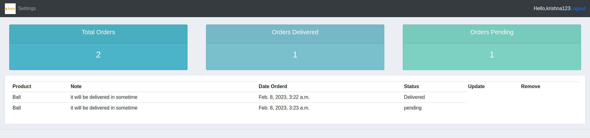

# Customer Management Sysem

## Introduction





***Customer management system*** is a web App where customer can see their order status and admin can create,update,delete the order of customer.

It is developed using Django web-framework and uses SQL-based database. It uses Python programming language for the rest of backend work.

## Getting Started

Set up virtual environment and install the dependencies using the commands:

```bash
python3 -m venv venv
source venv/bin/activate
pip install -r requirements.txt
```

Then run the Django development server using:

```
python manage.py runserver
```
To create a superuser (admin) account, run:

```
python manage.py createsuperuser
```

Navigate to `localhost:8000` in your browser.

